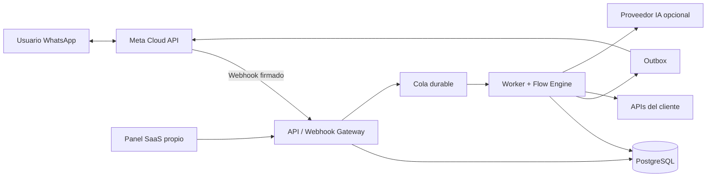
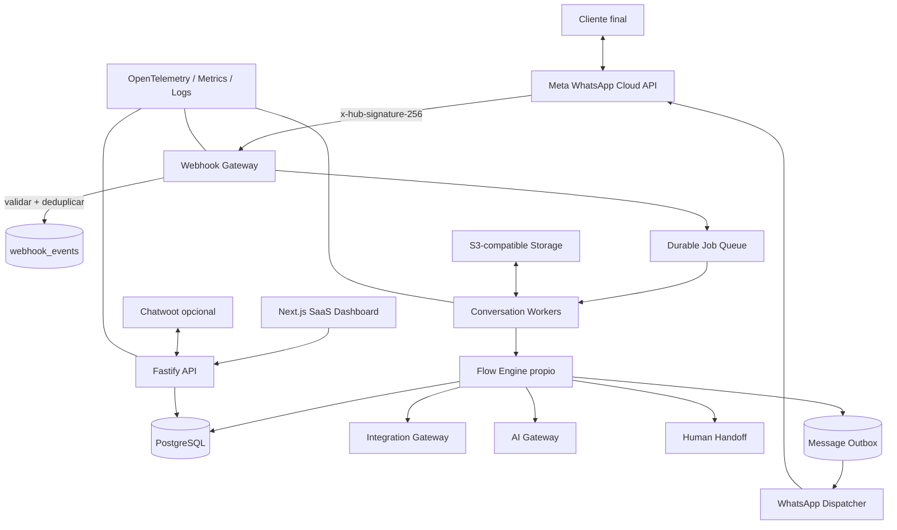
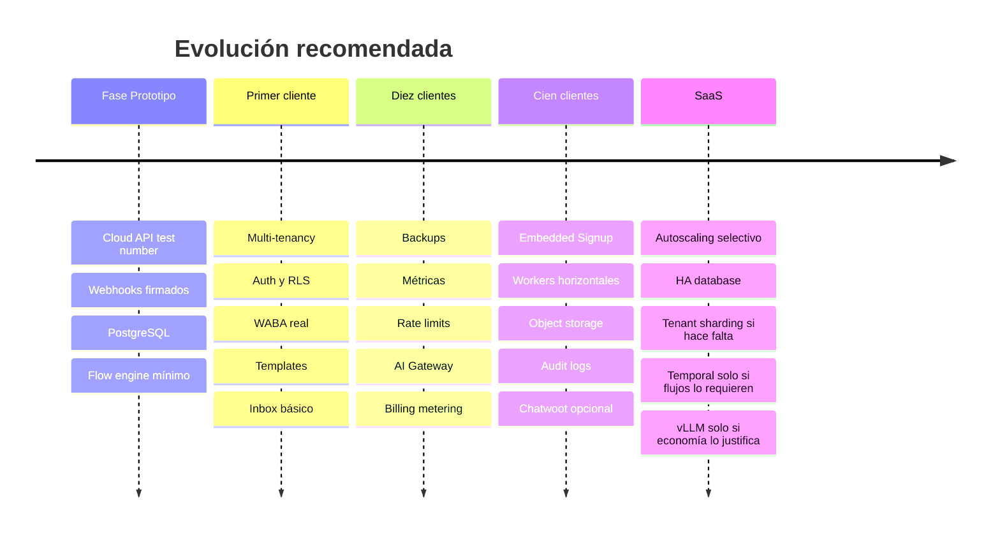

# Investigación profunda: plataforma SaaS multi-tenant de bots automatizados para WhatsApp

**Fecha de verificación:** 17 de agosto de 2026, America/Santiago.  
**Objetivo:** construir una plataforma comercial para múltiples clientes, self-hosted, con el menor coste recurrente posible, control del código, capacidad de white-label y una arquitectura que pueda evolucionar de 10 a 1.000+ clientes sin rehacer el producto.

El alcance de esta investigación sigue el pliego técnico que preparaste y adjuntaste, incluyendo Typebot, WhatsApp oficial/no oficial, licencias, multi-tenancy, Chatwoot, n8n, alternativas, IA, seguridad, costes, arquitectura y roadmap. fileciteturn0file0

## Resumen ejecutivo y decisión

Mi conclusión principal es bastante clara:

> **No construiría tu SaaS encima de Typebot.**
>
> **Construiría un core propio, pequeño y multi-tenant, en TypeScript, conectado directamente a WhatsApp Cloud API, reutilizando componentes open source donde aporten valor.**
>
> Usaría **OpenBSP como referencia y potencial fuente de componentes**, **Chatwoot de forma opcional para atención humana**, **n8n solo para automatizaciones internas**, y no utilizaría Evolution API/Baileys como transporte principal de clientes comerciales.

La razón más importante no es tecnológica. Es **licencia + modelo de negocio**.

Typebot es un proyecto técnicamente muy interesante y muy activo, con alrededor de 10.000 estrellas, más de 3.800 commits, un monorepo TypeScript moderno, API, un builder visual excelente, Docker y una integración real con WhatsApp Cloud API. Pero sus versiones actuales están bajo **Functional Source License**, no bajo una licencia open source permisiva tradicional. La licencia excluye expresamente el *Competing Use*: poner el software a disposición de terceros como producto o servicio comercial que sustituya o tenga funcionalidad sustancialmente similar a Typebot. Eso se parece demasiado al SaaS que quieres construir. citeturn31search0turn2view0

La versión actual se convierte en Apache 2.0 después del período de dos años definido por FSL, pero esa conversión ocurre **versión por versión**. Por ello, basarte hoy en una versión antigua ya convertida implicaría quedarte aproximadamente dos años por detrás de muchas mejoras y parches de seguridad, y después mantener tú mismo el fork. citeturn2view0

Además, Typebot ha corregido en 2025–2026 vulnerabilidades importantes relacionadas precisamente con capacidades peligrosas para un SaaS multi-tenant: SSRF desde bloques HTTP y falta de validación de firma en el webhook de WhatsApp. Eso no significa que Typebot sea inseguro hoy —las vulnerabilidades citadas están parcheadas—, sino que demuestra por qué tu arquitectura debe tratar HTTP arbitrario, JavaScript, credenciales y webhooks como fronteras de seguridad de primer nivel. citeturn31search6turn31search7

**WhatsApp Cloud API oficial de Meta debería utilizarse desde el primer cliente real.** Actualmente Meta cobra por mensajes entregados según categoría y mercado; las respuestas de servicio dentro de la ventana de atención pueden ser gratuitas y existen escenarios en los que el coste de mensajería de Meta es literalmente $0. La integración oficial evita la fragilidad, emparejamiento QR y riesgo operativo de los clientes que emulan WhatsApp Web. citeturn11view0turn12view1turn17search0

Mi arquitectura ganadora sería:

| Componente | Elección |
|---|---|
| Producto / IP principal | **Código propio** |
| Frontend SaaS | **Next.js + React + React Flow** |
| Backend | **TypeScript + Fastify** |
| Motor de bots | **Propio, basado en máquina de estados/JSON** |
| WhatsApp | **Meta WhatsApp Cloud API directa** |
| Onboarding WhatsApp | Manual inicialmente → **Meta Embedded Signup** |
| DB | **PostgreSQL** |
| Multi-tenancy | `tenant_id` + RLS + aislamiento de credenciales |
| Cola inicial | **PostgreSQL-backed durable jobs** |
| Cola futura | Adaptador a una cola dedicada si realmente hace falta |
| Cache | Ninguna inicialmente; Valkey cuando haya necesidad |
| IA | API intercambiable inicialmente; Ollama/vLLM posteriormente |
| RAG | PostgreSQL/vector store cuando aparezca el caso real |
| Human inbox | **Chatwoot opcional**, no core |
| Automatización genérica | Código propio / Activepieces CE evaluable; n8n solo interno |
| Object storage | S3-compatible |
| Proxy | **Caddy** |
| Deploy inicial | **Docker Compose** |
| Observabilidad inicial | logs estructurados + métricas |
| Observabilidad posterior | OpenTelemetry + Prometheus/Grafana/Loki |
| Kubernetes | **No** hasta que exista una razón operativa real |

En términos de las opciones de tu planteamiento original, elegiría:

**E) Crear nuestra propia plataforma utilizando componentes open source existentes**, con elementos de **D) combinar proyectos open source**, pero sin hacer depender la propiedad intelectual central de Typebot, n8n, Dify o Evolution.

Una alternativa especialmente interesante que apareció durante la investigación es **OpenBSP**: tiene licencia Unlicense, utiliza la API oficial de WhatsApp, incorpora multi-tenancy, Embedded Signup/coexistence, organizaciones, conversaciones, contactos, API keys y webhooks, y está explícitamente pensado para proveedores que quieran gestionar clientes. El problema es madurez: el repositorio observado tenía unos 329 stars, 147 forks y 220 commits, muchísimo menos historial que Typebot o Chatwoot. Yo **estudiaría y reutilizaría selectivamente su diseño y código**, pero no delegaría toda tu arquitectura a ese proyecto sin una auditoría propia. citeturn29search1

## Typebot: auditoría técnica, licencia y adecuación real

**Estado del proyecto.** Typebot no parece abandonado. El repositorio sigue activo, dispone de releases v3.17.x y la release más reciente observada es **v3.17.2**, publicada el 17 de junio de 2026. Hay actividad de issues durante 2026 y el repositorio ronda las 10.000 estrellas y más de 3.800 commits. citeturn1view1turn31search0turn0search10

No obtuve de una fuente estable durante esta auditoría un número actual fiable de contribuidores únicos ni una mediana estadística de tiempo de resolución de issues; ambos quedan **NO CONFIRMADOS**. Sí hay ejemplos de interacción rápida del mantenedor, pero un issue concreto no permite inferir el SLA general del proyecto. citeturn24search1

### Cómo está construido

Typebot es fundamentalmente un **monorepo TypeScript** administrado con Nx y Bun. Sus aplicaciones están separadas en builder, viewer/runtime, landing page, documentación y servicios/workflows; además dispone de paquetes compartidos. El propio repositorio contiene documentación específica para agentes de programación mediante `AGENTS.md` y directorios de entornos para Codex, algo que lo convierte en un proyecto relativamente amigable para coding agents a pesar de su tamaño. citeturn2view1turn3view1turn3view2

Su Docker Compose oficial separa al menos:

- PostgreSQL 16.
- Redis.
- Typebot Builder.
- Typebot Viewer.
- volúmenes persistentes y red compartida. citeturn3view0

En el ecosistema de Typebot hay más de 34 bloques de conversación y capacidades para texto, imágenes, vídeo, audio, inputs, botones, condiciones, JavaScript, A/B testing, webhooks/HTTP, OpenAI, Google Sheets, Analytics, Meta Pixel, Zapier, Make y Chatwoot. También expone APIs y permite ejecutar bots mediante HTTP. citeturn31search0

El modelo de producto incluye **workspaces** y APIs asociadas a ellos, con autenticación mediante token. Eso resulta útil para automatizar Typebot desde otro sistema. citeturn4search0turn5search2

Sin embargo:

> Un workspace de Typebot **no equivale automáticamente** a una arquitectura SaaS multi-tenant diseñada para que tú seas propietario de la capa de tenants, planes, permisos, facturación, dominios, números de WhatsApp y aislamiento de datos.

Por ejemplo, una petición histórica para configurar una URL/base diferente por workspace orientada a múltiples clientes fue cerrada como “not planned”. No es prueba de que Typebot no pueda utilizarse con múltiples clientes, pero sí evidencia que su modelo de workspace no está concebido necesariamente como la capa de tenancy de tu producto. citeturn0search4

La configuración self-hosted ha utilizado NextAuth para autenticación; el detalle exacto de proveedores y arquitectura actual de autenticación debería volver a verificarse antes de cualquier fork porque es una parte que puede evolucionar. citeturn31search2

**Sistema público estable de plugins para terceros:** **NO CONFIRMADO.** Typebot es extensible modificando sus packages/bloques e integraciones, pero no encontré evidencia suficiente para tratarlo como una plataforma con un contrato de plugins estable comparable a un SDK independiente.

**Backend de almacenamiento de ficheros exacto y todas sus opciones actuales:** **NO CONFIRMADO** en las fuentes examinadas. PostgreSQL y Redis sí están confirmados en el despliegue Docker. citeturn3view0

### La licencia cambia la decisión

Typebot se describe actualmente como **Fair Source**, no simplemente “open source”. La licencia de las versiones actuales es **FSL-1.1-Apache-2.0**. citeturn31search0turn2view0

La FSL permite usos significativos, incluida modificación y determinados usos internos/profesionales, pero define como uso excluido el **Competing Use**, es decir, poner el software a disposición de terceros dentro de un producto o servicio comercial que sustituya a Typebot o que ofrezca funcionalidad igual o sustancialmente similar. Cada versión pasa posteriormente a Apache 2.0 tras el período definido de dos años. La licencia tampoco concede derechos sobre las marcas. citeturn2view0

Aplicado a tu proyecto:

| Uso | Evaluación |
|---|---|
| Instalar Typebot para uso interno de tu propia empresa | **Compatible en principio** |
| Modificarlo internamente | **Compatible en principio** |
| Hacer consultoría/implementación para un cliente que lo utiliza | **Puede entrar en los usos permitidos** |
| Cobrar por tu servicio de automatización sin exponer Typebot como producto | Depende de la arquitectura contractual |
| Crear “mi propio Typebot” multi-tenant y vender cuentas | **Alto riesgo de Competing Use** |
| White-label completo y venderlo como builder SaaS | **No lo consideraría seguro bajo la versión actual** |
| Fork de versión actual para competir con Typebot | **No lo haría** |
| Fork de código que ya haya convertido a Apache 2.0 | Legalmente mucho más permisivo, pero técnicamente problemático |
| Usar la marca Typebot como propia | No; los derechos de marca no vienen incluidos |

Esto no sustituye una opinión jurídica, pero desde una decisión de arquitectura de fundador, **la incertidumbre ya es suficientemente alta para descartarlo como core**.

### Seguridad y mantenimiento

Typebot ha reaccionado a problemas reales. Entre otros:

- Una vulnerabilidad crítica de SSRF en el bloque HTTP podía utilizarse para acceder a metadatos de infraestructura AWS; quedó corregida en v3.13.1. citeturn31search6
- En 2026 se corrigieron problemas relacionados con aislamiento de credenciales entre workspaces y SSRF en previews. citeturn0search8turn0search9
- El webhook de WhatsApp Cloud API no validaba `x-hub-signature-256` hasta el parche incorporado en v3.17.0. citeturn31search7
- Las releases recientes añadieron mitigaciones y allowlists relacionadas con SSRF. citeturn1view1turn0search3

Es un indicio positivo de mantenimiento, pero también una advertencia de arquitectura: **un SaaS donde cada cliente pueda ejecutar HTTP arbitrario, código o conexiones de terceros se convierte inmediatamente en una plataforma de ejecución no confiable**.

Por eso yo no incluiría un bloque “ejecutar JavaScript libre” en tu MVP.

### ¿Es bueno para Codex?

Paradójicamente, sí.

Typebot tiene buenas características para un coding agent: TypeScript, monorepo estructurado, Nx, tests con Vitest, documentación de agentes y hasta entornos específicos para Codex. citeturn3view2turn31search0

Pero la facilidad con la que Codex puede modificarlo **no soluciona la licencia ni la complejidad del dominio**.

Es preferible que Codex trabaje sobre 20.000–50.000 líneas de tu propio dominio muy bien documentado que sobre centenares de miles de líneas de una plataforma ajena donde una actualización upstream puede chocar con tus modificaciones.

**Veredicto Typebot:**

> Excelente producto para estudiar.  
> Excelente referencia UX.  
> Buen chatbot builder self-hosted.  
> **Mala base jurídica/estratégica para el SaaS que quieres vender.**

## WhatsApp oficial, no oficial y costes reales

La decisión más importante después de Typebot es elegir **qué significa exactamente “conectar WhatsApp”**.

Existen dos mundos completamente diferentes.

### Ruta oficial: WhatsApp Business Platform / Cloud API

Cloud API es la API oficial alojada por Meta. La configuración productiva gira alrededor de un Business Portfolio, WhatsApp Business Account —WABA—, número de teléfono y permisos como `whatsapp_business_management` y `whatsapp_business_messaging`. Meta también expone Business Management APIs para administrar esos activos. citeturn17search0turn17search1

Para un SaaS multi-cliente, **Meta Embedded Signup** es el mecanismo relevante a medio plazo: permite incorporar cuentas de clientes mediante el flujo de Meta en lugar de pedirles tokens manualmente. La documentación oficial lo sitúa dentro del ecosistema de Tech Providers/Solution Partners. citeturn17search1

Las condiciones para proveedores son especialmente relevantes para tu negocio. Las condiciones de WhatsApp contemplan proveedores autorizados que operan para clientes, exigen que el cliente acepte las condiciones correspondientes, separan las WABA de los distintos clientes y contemplan portabilidad cuando el cliente quiere migrar. citeturn15view1

Por eso tu modelo de datos debería ser:

```text
Tenant
   └── Meta Business / WABA del cliente
          ├── phone_number_1
          ├── phone_number_2
          └── ...
```

No:

```text
Mi WABA gigante
   ├── número cliente A
   ├── número cliente B
   └── número cliente C
```

para todos los escenarios.

### La ventana de servicio y cuándo Meta puede costar $0

El pricing oficial actual de WhatsApp Business Platform se basa en **mensajes entregados**, diferenciando categorías como marketing, utility, authentication y service. citeturn11view0

Cuando un usuario escribe al negocio se abre una ventana de servicio de 24 horas. Durante esa ventana pueden enviarse respuestas de servicio sin coste de mensajería de Meta; además, determinados mensajes utility enviados en respuesta al usuario son gratuitos. Meta mantiene también el *free entry point*: cuando el usuario llega mediante ciertos anuncios Click-to-WhatsApp o CTA de Facebook, existe una ventana gratuita ampliada de 72 horas bajo las condiciones de Meta. citeturn11view0turn12view1

Fuera de la ventana de atención, la empresa normalmente necesita utilizar templates aprobados para iniciar/reabrir comunicación; marketing, authentication y utility pueden generar cobros según categoría y mercado. citeturn11view0turn12view1

Por tanto:

> **Sí, es posible que tu bot comercial tenga $0 de coste de mensajería Meta.**

Ejemplo típico:

```text
Cliente final → "Hola, quiero reservar"

Bot → "Claro. ¿Para qué día?"
Cliente → "Mañana"
Bot → "¿A qué hora?"
...
```

si la interacción se mantiene dentro de las condiciones de la ventana de servicio.

Eso **no significa operación total $0**, porque sigue existiendo tu servidor, backups, dominio y posiblemente IA.

El precio numérico oficial vigente para Chile no quedó expuesto de manera suficientemente fiable por el selector dinámico de la página oficial durante esta auditoría, así que la cifra exacta se marca:

> **Tarifa directa Meta Chile por categoría al 17-08-2026: NO CONFIRMADA numéricamente en esta extracción.**

Como referencia externa exclusivamente para hacer simulaciones, la página actual de Plivo para Chile mostraba aproximadamente **$0,0978 marketing, $0,0220 utility/authentication y $0 para service**. Ese valor **no debe confundirse con una cotización directa de Meta**, ya que se trata del pricing de un proveedor. citeturn26search7

La página oficial de Meta debe ser la fuente de verdad cuando vayas a emitir precios comerciales a tus clientes. citeturn11view0

### Cloud API vs BSP

No necesitas introducir un BSP simplemente para que “la API funcione”. Cloud API está alojada por Meta y puede consumirse directamente. Un BSP puede aportar soporte, onboarding, tooling y facturación, pero también puede introducir margen o cuota adicional. citeturn17search0turn11view0

Mi recomendación:

```text
Primeros clientes
    ↓
Cloud API directa
    ↓
onboarding manual

Cuando el producto madura
    ↓
Cloud API directa
    +
Meta Embedded Signup
```

No añadiría Twilio, 360dialog u otro BSP salvo que aporte una función empresarial que justifique explícitamente su coste.

### Ruta no oficial: Baileys, whatsapp-web.js, WAHA, WPPConnect, Evolution

Aquí el mecanismo es completamente distinto.

`whatsapp-web.js` utiliza Puppeteer para interactuar con WhatsApp Web y su propio proyecto advierte que no existe garantía de que las cuentas no sean bloqueadas y que no es una solución oficial de WhatsApp. La release observada seguía activa en 2026. citeturn20search0

Baileys implementa la comunicación de WhatsApp Web a nivel de sockets/protocolo, sin necesitar un Chromium completo como whatsapp-web.js. El repositorio mantiene una advertencia explícita contra spam/violaciones de los términos y seguía lanzando versiones 7.x RC en 2026. citeturn20search1turn20search7

Además de riesgo de plataforma existe riesgo de seguridad: Baileys corrigió en mayo de 2026 una vulnerabilidad crítica que permitía eventos `messages.upsert` falsificados y corrupción del estado sincronizado. citeturn21search4

WPPConnect sigue activo y expone texto, imágenes, vídeo, audio, documentos, contactos, grupos, sesiones múltiples, ubicación, recepción y otras funciones sobre WhatsApp Web. Su librería principal está bajo LGPL-3.0 y su servidor ha utilizado Apache-2.0; la organización seguía actualizando proyectos en mayo de 2026. citeturn21search0turn21search5turn21search15

WAHA proporciona una API HTTP alrededor de distintos motores: WEBJS basado en navegador, NOWEB mediante WebSocket/Node y GOWS en Go. El proyecto principal está bajo Apache-2.0 y seguía activo en julio de 2026. citeturn21search2

Un issue real de WAHA de febrero de 2026 muestra bien el problema operacional: una operación que fallaba con `WEBJS` funcionaba usando `GOWS`. Es una experiencia anecdótica, no una medición de fiabilidad, pero ilustra que los cambios internos de WhatsApp pueden romper motores de forma diferente. citeturn21search11

Evolution API intenta poner una capa REST de más alto nivel por encima del ecosistema y además puede trabajar con la Cloud API oficial. Integra Typebot, Chatwoot, Dify, OpenAI, colas y almacenamiento. citeturn20search2

Pero su licencia merece especial atención: se presenta como Apache 2.0 **con condiciones adicionales**, entre ellas preservación de branding en determinados componentes y obligación de notificar el uso de Evolution API. Por tanto no la trataría jurídicamente como una dependencia “Apache 2.0 limpia”; la naturaleza exacta de la licencia combinada y su clasificación OSI queda **NO CONFIRMADA** y debería revisarse antes de integrarla en un producto cerrado. citeturn21search1turn21search3

También existen fallos funcionales reales relacionados con el mundo Baileys: por ejemplo, un issue de 2026 donde mensajes de botones recibían respuesta HTTP exitosa pero no eran entregados. citeturn20search13

La versión Evolution API Lite fue archivada en mayo de 2026, por lo que no la consideraría una base nueva. citeturn20search4

### Comparación práctica

| Opción | Oficial | QR | WhatsApp Web | Templates oficiales | Multimedia | Grupos | Multi-número | Riesgo operacional comercial |
|---|---:|---:|---:|---:|---:|---:|---:|---|
| Meta Cloud API | ✅ | ❌ | ❌ | ✅ | ✅ | Limitado/version-dependent | ✅ | **Bajo** |
| BSP sobre Cloud API | ✅ | ❌ | ❌ | ✅ | ✅ | Según API oficial | ✅ | **Bajo** |
| Evolution + Cloud API | ✅ transporte | ❌ | ❌ | ✅ | ✅ | Según Cloud API | ✅ | Bajo/medio por capa extra |
| Evolution + Baileys | ❌ | ✅ | ✅/protocolo Web | ❌ equivalente oficial | ✅ | ✅ | ✅ | **Alto** |
| Baileys | ❌ | ✅ | protocolo Web | ❌ | ✅ | ✅ | Implementable | **Alto** |
| whatsapp-web.js | ❌ | ✅ | ✅ Puppeteer | ❌ | ✅ | ✅ | Implementable | **Alto** |
| WAHA | ❌ en motores Web | ✅ | WEBJS/NOWEB/GOWS | ❌ | ✅ | Según motor | ✅ | **Alto** |
| WPPConnect | ❌ | ✅ | ✅ | ❌ | ✅ | ✅ | ✅ | **Alto** |

Algunas capacidades relativamente nuevas de Cloud API, como grupos o llamadas, están evolucionando. Su cobertura exacta productiva por cuenta/mercado/API version es **NO CONFIRMADA** en las fuentes primarias utilizadas aquí; no diseñaría el MVP alrededor de ellas.

La conclusión comercial es simple:

| Contexto | Tecnología que usaría |
|---|---|
| Laboratorio personal | Baileys/WAHA pueden ser útiles |
| Demo muy rápida | Evolution/Baileys aceptables con número prescindible |
| Cliente pequeño pagando | **Cloud API** |
| Agencia profesional | **Cloud API** |
| SaaS multi-tenant | **Cloud API** |
| 1.000 clientes | **Cloud API + Embedded Signup** |

Hay incluso un issue de Baileys de enero de 2026 en el que un desarrollador reportó suspensión temporal y posteriormente permanente después de automatizar estados. Eso es evidencia anecdótica, no prueba de causalidad universal, pero confirma por qué no construiría el activo principal de una empresa sobre una integración no autorizada. citeturn20search9

### Un detalle importante sobre IA y WhatsApp

Las condiciones de WhatsApp actualizadas en marzo de 2026 contienen reglas específicas para proveedores de AI/ML cuando la IA constituye la funcionalidad principal del servicio, mientras permiten utilizar proveedores de IA como terceros dentro de una solución empresarial bajo determinadas condiciones y restringen el uso de Business Solution Data para entrenar modelos generales. citeturn15view0

**Mi inferencia de producto**, no asesoría jurídica, es que deberías posicionar y construir el producto como:

> “plataforma de atención, automatización, ventas, reservas y operaciones para empresas, con capacidades de IA”

y no como:

> “ChatGPT general por WhatsApp”.

Eso encaja mejor con el propósito empresarial de WhatsApp y disminuye el riesgo de que la IA sea interpretada como la función primaria del servicio. Las condiciones de Meta deben volver a revisarse antes de cada lanzamiento importante; además, la página de términos observada anuncia futuras modificaciones para septiembre de 2026. citeturn14view1turn15view0

## Alternativas a Typebot, Chatwoot, n8n y licencias

No existe un sustituto único que gane a Typebot en todos los aspectos porque las plataformas analizadas resuelven problemas diferentes.

Ese es precisamente el error que evitaría: intentar encontrar **“el programa que haga todo”**.

### Chatwoot

Chatwoot sí tiene un papel claro.

El proyecto sigue activo, ofrece self-hosting, API, contactos, conversaciones, agentes y WhatsApp. Su arquitectura self-hosted utiliza Ruby on Rails/Vue, PostgreSQL y Redis. La propia documentación recomienda en producción aproximadamente 4 cores y 8 GB de RAM como mínimo, con 16 GB recomendados, por lo que introducirlo desde el primer día aumenta significativamente el footprint de un MVP económico. citeturn19search1turn19search7

La licencia es **open-core**: el código fuera de `enterprise/` está bajo MIT, mientras que el directorio enterprise tiene licencia comercial. citeturn19search3turn19search0

Su Community Edition self-hosted aparece a $0 por agente, pero funciones como custom branding, determinados controles empresariales, SSO y otras capacidades se reservan a planes comerciales. citeturn19search9

Por tanto:

> **Chatwoot no debería ser el core de tu plataforma.**
>
> Debería ser el módulo opcional de human handoff / bandeja multiagente.

Arquitectura correcta:

```text
WhatsApp
   ↓
TU BACKEND
   ├── Motor de bots
   ├── IA
   └── Chatwoot opcional
          ↓
       Agentes humanos
```

No:

```text
WhatsApp
   ↓
Chatwoot
   ↓
todo tu negocio
```

Un issue de enero de 2026 donde webhooks de Cloud API reenviados mediante n8n dejaron de crear mensajes correctamente después de determinadas actualizaciones de Chatwoot ilustra otra razón para evitar encadenar demasiadas plataformas en el camino crítico. citeturn24search11

### n8n

n8n es probablemente mejor motor genérico de automatizaciones que Typebot, pero **peor base legal para tu SaaS**.

Su código principal utiliza la Sustainable Use License, que permite ampliamente uso interno, pero no permite simplemente white-label, revender acceso o hospedar n8n como producto comercial competidor sin licencia apropiada. La propia FAQ ofrece una distinción muy importante: usar n8n como backend para procesos de tu empresa puede estar permitido, pero workflows que utilizan credenciales que tus usuarios aportan para sus propios servicios pueden requerir una licencia comercial diferente. citeturn18search1turn18search2

Por eso:

```text
TU SaaS
  ↓
n8n oculto para automatizaciones tuyas
```

puede tener sentido.

Esto:

```text
Cliente
  ↓
"crea tus workflows en nuestro n8n"
```

no lo utilizaría sin acuerdo comercial.

Y esto:

```text
Cliente añade su HubSpot token
       ↓
tu n8n
       ↓
HubSpot
```

debe revisarse especialmente contra la licencia porque es muy parecido al ejemplo descrito en la FAQ oficial. citeturn18search2

Mi conclusión: **n8n interno sí; n8n como componente estructural tenant-facing, no.**

### Alternativas con licencias más favorables

| Proyecto | Licencia observada | Qué hace bien | Problema para tu SaaS |
|---|---|---|---|
| **Activepieces CE** | MIT; enterprise comercial | Automatización visual, TypeScript, connectors | Multi-tenancy/RBAC exacto de CE: **NO CONFIRMADO** |
| **Node-RED** | Apache 2.0 | Flujos event-driven, enorme ecosistema | No está diseñado como UX SaaS multi-tenant de bots |
| **Flowise** | Apache 2.0 | Agentes/RAG/IA visual | No es una plataforma WhatsApp/customer-service |
| **Langflow** | MIT | Agentes y workflows IA | Mismo problema: no es tenancy/messaging |
| **Dify** | Apache modificada | IA/RAG/workflows muy completos | Su licencia exige comercial para multi-tenant |
| **Rasa OSS** | Apache 2.0 | NLU/dialogue clásico | Más framework que producto; poca ventaja para tu caso |
| **Temporal** | MIT | Durable workflows a gran escala | Demasiado pronto para un MVP |
| **Kestra** | Apache 2.0 | Orquestación/eventos | Overkill para conversaciones |
| **Windmill** | AGPL + comercial/proprietario | Workflows/scripts internos | Restricciones para embed/managed service |
| **Botpress repo** | MIT | Ecosistema conversational/AI | Correspondencia entre repo OSS y producto cloud actual: **NO CONFIRMADA** |
| **OpenBSP** | Unlicense | WhatsApp oficial + multi-tenant | Proyecto joven |
| **Typebot** | FSL → Apache diferido | Mejor UX de chatbot visual | Competing Use |

Activepieces mantiene una Community Edition MIT y separa funciones enterprise bajo licencia comercial. Es considerablemente más interesante jurídicamente que n8n si algún día decides incorporar un motor de automatización visual, aunque habría que comprobar cuáles de las funciones de tenancy, branding y administración que necesitas permanecen en CE. citeturn22search5

Node-RED sigue bajo Apache-2.0 dentro de OpenJS Foundation, con más de 23.000 stars y releases durante 2026. Es una opción sólida como motor técnico, pero no resuelve por sí solo SaaS tenancy, WhatsApp, conversaciones y clientes. citeturn23search1turn23search5

Flowise sigue bajo Apache-2.0 y está especialmente orientado a construir agentes visualmente; la release observada en la búsqueda fue 3.1.2 de abril de 2026. Es una buena herramienta opcional de laboratorio para IA, pero no sustituye tu dominio de negocio. citeturn22search4

Langflow está bajo MIT y ofrece flows que pueden exponerse por API, herramientas de agentes y despliegue Docker; sería otra buena capa de experimentación IA. citeturn22search3turn22search14

Dify es técnicamente muy atractivo pero su licencia modificada de Apache indica expresamente que operar un entorno multi-tenant basado en su código requiere autorización/licencia comercial y también establece condiciones respecto al frontend/logo. Esto lo elimina para tu requisito de “SaaS multi-tenant libre”. citeturn22search1turn22search2

Temporal sigue bajo MIT y tenía release v1.31.2 en julio de 2026. Lo considero una excelente opción futura si llegas a tener flujos durables de días/semanas, millones de ejecuciones y necesidades complejas de recuperación, pero añadir Temporal a un SaaS con diez clientes sería sobrearquitectura. citeturn23search4

Kestra sigue siendo Apache-2.0 y tiene un ecosistema importante de plugins y workflows event-driven, pero tiene el mismo problema conceptual: resolvería una infraestructura de workflow mucho más genérica de la que necesitas. citeturn23search0turn23search13

Windmill requiere mucha más cautela: el source tiene partes AGPL/Apache y enterprise comercial; la Community Edition distribuida incluye además condiciones que prohíben determinados usos de managed service, wrapping o reventa sin acuerdo. Lo descartaría como corazón de este SaaS. citeturn29search0turn29search3

### OpenBSP merece especial atención

OpenBSP es el descubrimiento que más cambia la comparación inicial.

Su repositorio se describe específicamente como:

- plataforma WhatsApp Business.
- self-hostable.
- multi-tenant.
- preparada para AI agents.
- conectada a la API oficial.
- compatible con Embedded Signup/coexistence.
- Deno + PostgreSQL/Supabase.
- organizaciones aisladas.
- contactos/conversaciones/mensajes.
- API keys por organización.
- webhooks.
- agentes.
- licencia Unlicense. citeturn29search1

Su arquitectura almacena mensajes en PostgreSQL, dispara funciones sobre nuevos mensajes, llama al agente y posteriormente despacha la respuesta hacia la API oficial. Esa separación entre canal y agente es justamente el patrón correcto. citeturn29search1

Mi objeción es solo madurez: unos cientos de stars y 220 commits son una escala muy distinta de Typebot, Chatwoot o n8n. citeturn29search1

Por eso no haría:

```text
Nuestro producto = OpenBSP con otro logo
```

Haría:

```text
Estudiar OpenBSP
       ↓
Auditar código
       ↓
Reutilizar:
 - Meta onboarding
 - Embedded Signup patterns
 - webhook management
 - schemas útiles
 - account management
       ↓
Integrarlo en NUESTRO core
```

Su licencia lo hace mucho más interesante para ese enfoque que Typebot.

### Matriz de decisión

Las siguientes son **puntuaciones de ingeniería propias**, de 1 a 10, no puntuaciones publicadas por los proyectos. Los criterios jurídicos se basan en las licencias descritas anteriormente. citeturn2view0turn18search2turn19search3turn22search1turn22search4turn22search5turn23search1turn29search1

Pesos: licencia SaaS 18%, WhatsApp 13%, multi-tenancy 12%, visual builder 9%, extensibilidad 10%, IA 6%, madurez 8%, coste 7%, seguridad/control 6%, Codex 6%, white-label 5%.

| Opción | Lic. | WA | Tenant | Visual | Ext. | IA | Mad. | Coste | Control | Codex | WL | Total |
|---|---:|---:|---:|---:|---:|---:|---:|---:|---:|---:|---:|---:|
| **Core propio + OSS** | 10 | 10 | 10 | 7 | 10 | 9 | 5 | 9 | 9 | 10 | 10 | **9,14** |
| **OpenBSP + core propio** | 10 | 10 | 9 | 3 | 9 | 8 | 4 | 9 | 7 | 8 | 10 | **8,18** |
| Flowise | 10 | 3 | 4 | 8 | 9 | 10 | 8 | 8 | 7 | 8 | 9 | **7,44** |
| Activepieces CE | 9 | 4 | 5 | 8 | 9 | 8 | 7 | 8 | 7 | 8 | 8 | **7,26** |
| Node-RED | 10 | 3 | 3 | 8 | 9 | 5 | 9 | 9 | 7 | 7 | 9 | **7,11** |
| Chatwoot | 7 | 9 | 8 | 3 | 8 | 5 | 9 | 6 | 8 | 6 | 5 | **6,99** |
| Typebot | 3 | 8 | 6 | 10 | 8 | 8 | 8 | 8 | 6 | 8 | 4 | **6,72** |
| n8n | 3 | 5 | 5 | 10 | 10 | 9 | 10 | 8 | 8 | 8 | 3 | **6,70** |
| Dify | 2 | 3 | 2 | 9 | 9 | 10 | 10 | 7 | 8 | 7 | 2 | **5,59** |

Lo revelador es que **Typebot gana claramente el visual builder**, pero pierde demasiados puntos justamente en las variables que más importan al fundador de un SaaS: libertad comercial, tenancy propio y white-label.

## Arquitectura multi-tenant, escalabilidad y seguridad

Hay dos formas clásicas de dar servicio a cien clientes:

```text
100 clientes
= 100 instalaciones
```

o:

```text
100 clientes
= 1 plataforma
  + tenant isolation
```

Para tu caso elegiría inequívocamente la segunda.

### Instancia por cliente

Ventajas: aislamiento excelente, fácil de entender, un fallo puede afectar solo a ese cliente.

Problemas: actualizaciones, backups, certificados, migrations, observabilidad, secrets, RAM base y operaciones se multiplican por cada cliente.

Con 10 clientes podría tolerarse.

Con 100 sería una carga operativa absurda.

Con 1.000 sería prácticamente otra empresa dedicada a administrar instalaciones.

### Multi-tenant centralizado

Yo utilizaría un `tenant_id` obligatorio en todas las entidades del dominio:

```text
tenant
user
tenant_membership

whatsapp_account
whatsapp_phone_number

contact
conversation
message

flow
flow_version
flow_run

credential
integration

webhook_event
outbox_event
job

audit_log
```

Cada tabla de negocio tendría:

```text
tenant_id
```

y PostgreSQL utilizaría **Row-Level Security** como segunda barrera de aislamiento además de los filtros del backend.

No confiaría solamente en:

```typescript
where: { tenantId }
```

en el código.

La seguridad multi-tenant debe existir igualmente a nivel de DB.

### Qué haría según el tamaño

| Clientes | Arquitectura |
|---:|---|
| 1–10 | Una aplicación + un DB + un worker |
| 10–50 | Multi-tenant centralizado |
| 50–100 | Igual, workers horizontales |
| 100–500 | API y workers separados; almacenamiento de medios externo |
| 500–1.000 | varios workers/API, DB dedicado, réplicas/backups robustos |
| 1.000–10.000 | particionado/sharding por tenant si las métricas lo justifican |
| 10.000+ | clusters por grupos de tenants/regiones, no instancia individual |

No cambiaría de modelo lógico al escalar. Solo iría separando físicamente componentes.

### Arquitectura mínima



En esta etapa:

- Docker Compose.
- PostgreSQL.
- frontend.
- API.
- worker.
- Caddy.
- ninguna infraestructura distribuida.

### Arquitectura que recomiendo realmente



Lo importante es que **Meta no llama directamente al bot**.

El flujo debería ser:

```text
Webhook
 ↓
verificar firma
 ↓
parsear
 ↓
deduplicar
 ↓
guardar
 ↓
responder HTTP rápidamente
 ↓
procesar asíncronamente
```

Eso evita que una llamada lenta a OpenAI, CRM o API externa provoque retries de Meta.

### El flow engine que construiría

No necesitas reconstruir Typebot entero.

Tu primera versión solo necesita aproximadamente nueve nodos:

```text
START
SEND_MESSAGE
ASK_INPUT
CONDITION
HTTP_REQUEST
WAIT
AI
HANDOFF
END
```

Un flow podría almacenarse como:

```json
{
  "version": 3,
  "entryNodeId": "start",
  "nodes": {
    "start": {
      "type": "start",
      "next": "welcome"
    },
    "welcome": {
      "type": "send_message",
      "text": "Hola 👋 ¿En qué podemos ayudarte?",
      "next": "choice"
    },
    "choice": {
      "type": "ask_input",
      "variable": "request",
      "next": "route"
    },
    "route": {
      "type": "condition",
      "rules": []
    }
  }
}
```

React Flow solo edita ese JSON.

El worker ejecuta ese JSON.

Esa separación es extremadamente potente:

```text
React Flow
   ↓
Flow Definition JSON
   ↓
Flow Engine
```

La interfaz visual puede cambiar completamente sin alterar el runtime.

### Tres arquitecturas por nivel

| | Mínimo coste | Equilibrada | Gran escala |
|---|---|---|---|
| Frontend | Next.js | Next.js | Next.js/CDN |
| API | Fastify | Fastify replicas | Fastify replicas |
| WhatsApp | Cloud API | Cloud API | Cloud API |
| Queue | PostgreSQL | PostgreSQL / queue dedicada | queue dedicada si métricas lo piden |
| DB | PostgreSQL único | PostgreSQL dedicado | HA/particionado |
| Cache | no | Valkey opcional | Valkey cluster si necesario |
| Flow engine | propio | propio | propio/Temporal para workflows complejos |
| AI | API | API routing | API + vLLM opcional |
| Inbox | propio simple | Chatwoot opcional | Chatwoot/propio |
| Storage | disco/S3 | S3-compatible | object storage distribuido |
| Monitoring | logs | OTel + métricas | full observability |
| Deploy | Compose | Compose/k3s si justificado | K8s solamente si necesario |

Temporal es MIT y está diseñado precisamente para durable execution; es una migración futura mucho más lógica que introducirlo antes de tener un problema de durable workflow real. citeturn23search4

### Seguridad que considero obligatoria

**Firma de WhatsApp.** Validar `x-hub-signature-256` antes de aceptar el evento. El incidente corregido por Typebot demuestra que omitirlo permite a terceros falsificar eventos de WhatsApp. citeturn31search7

**Idempotencia.** `wamid`/identificador Meta debe tener constraint único para que un retry no genere dos reservas, dos respuestas o dos cobros.

**Credenciales.** Access tokens de Meta, CRM y LLM cifrados en reposo mediante envelope encryption; nunca visibles de nuevo en texto plano desde el dashboard.

**SSRF.** El nodo HTTP debe rechazar por defecto:

```text
127.0.0.0/8
10.0.0.0/8
172.16.0.0/12
192.168.0.0/16
169.254.0.0/16
::1
fc00::/7
metadata endpoints
```

y volver a verificar DNS después de resolverlo. El historial de SSRF en Typebot demuestra por qué esto no es teórico. citeturn31search6turn0search9

**JavaScript del cliente.** No permitiría código arbitrario en el MVP. Cuando realmente haga falta debe ejecutarse fuera del proceso de API/worker y dentro de un sandbox fuertemente aislado.

**RLS + application checks.** Un fallo de backend no debe bastar para leer conversaciones de otro tenant.

**Rate limit por tenant y número.** Evita que un cliente consuma toda tu capacidad o haga spam.

**Opt-in.** Meta exige que el negocio tenga permisos adecuados antes de contactar a los usuarios y que respete las solicitudes de opt-out. citeturn12view1

**Human escalation.** La política de Meta contempla automatización dentro de las conversaciones pero exige ofrecer vías claras de escalamiento cuando corresponda. citeturn12view1

**Audit log.** Cada cambio importante:

```text
quién
tenant
acción
recurso
timestamp
IP
resultado
```

**Webhooks de terceros.** Firmados cuando tú los emites.

**Media.** Límite de tamaño, MIME real y almacenamiento fuera del webroot.

**Backups.** Restauración probada, no simplemente “tenemos backups”.

## Costes, recursos e inteligencia artificial

La primera observación importante es que el volumen de mensajes que planteas es mucho menor en términos de QPS de lo que parece.

| Escenario | Mensajes/mes | Promedio por segundo |
|---|---:|---:|
| 10 × 1.000 | 10.000 | 0,0039 |
| 100 × 5.000 | 500.000 | 0,193 |
| 1.000 × 10.000 | 10.000.000 | 3,86 |

Incluso **10 millones de mensajes al mes son solo 3,86 mensajes/segundo de media**.

Tus problemas a esa escala serán antes:

- picos de tráfico.
- consultas de DB.
- IA.
- media.
- integraciones lentas.
- observabilidad.
- número de tenants.
- seguridad.

No Kafka.

### Recursos aproximados

Estas son **estimaciones de ingeniería**, no requisitos oficiales de proveedor. Asumen bots mayoritariamente de texto, Cloud API —por tanto WhatsApp no corre en tu servidor—, IA externa y almacenamiento de media separado cuando se crece.

| Clientes | vCPU total | RAM | Storage operativo | Arquitectura |
|---:|---:|---:|---:|---|
| 10 | 4 | 8 GB | 80–160 GB | 1 VPS |
| 50 | 8 | 16 GB | 160–300 GB | 1 VPS potente |
| 100 | 8–16 | 16–32 GB | 250–500 GB | app + DB separables |
| 500 | 16–32 | 32–64 GB | 0,5–1,5 TB | 2–3 nodos |
| 1.000 | 32–64 | 64–128 GB | 1–3 TB | varios workers + DB dedicado |

Si ejecutas LLMs localmente, esta tabla deja de aplicar: **la GPU pasa a ser el principal recurso**.

Como referencia de mercado actual, después del ajuste de precios de junio de 2026, Hetzner publica para Alemania/Finlandia precios de cloud ARM desde aproximadamente $6,99/mes para CAX11, $12,49 para CAX21, $24,99 para CAX31 y $48,49 para CAX41, excluyendo IPv4 e impuestos aplicables. citeturn28view0turn28view3

No necesitas necesariamente Hetzner; lo utilizo simplemente para demostrar que la infraestructura básica puede ser muy barata comparada con WhatsApp outbound o IA.

### Storage por volumen

Una estimación sencilla suponiendo unos 6 KB efectivos de metadata + índices por mensaje arroja:

| Mensajes/mes | DB aproximada incremental |
|---:|---:|
| 10.000 | ~0,06 GB |
| 500.000 | ~2,9 GB |
| 10.000.000 | ~57 GB |

Pero si solo el 5% de los mensajes incluye media de 500 KB de media:

| Mensajes/mes | Media aproximada |
|---:|---:|
| 10.000 | ~0,24 GB |
| 500.000 | ~12 GB |
| 10.000.000 | ~238 GB |

Por eso las imágenes/audio/documentos deben terminar en object storage y la DB conservar metadata/URLs.

### Cuánto cuesta WhatsApp

La ecuación correcta es:

```text
Coste Meta =
  marketing_delivered × rate_marketing(market)
+ utility_billable × rate_utility(market)
+ authentication × rate_auth(market)
```

y no:

```text
mensajes totales × tarifa fija
```

porque las respuestas de servicio pueden costar $0. citeturn11view0

Por tanto, el caso mínimo de tus escenarios puede ser:

| Escenario | Mensajes | Meta mínimo posible |
|---|---:|---:|
| 10 clientes | 10.000 | **$0** |
| 100 clientes | 500.000 | **$0** |
| 1.000 clientes | 10.000.000 | **$0** |

si todos corresponden a interacciones gratuitas elegibles.

Ahora consideremos un ejemplo deliberadamente más comercial:

```text
10% de todos los mensajes = utility cobrable
5% = marketing
85% = service/free/no cobrable
```

Usando exclusivamente como **proxy ilustrativo** el pricing de Plivo Chile observado de $0,0220 utility y $0,0978 marketing, no como precio contractual de Meta: citeturn26search7

| Escenario | WhatsApp proxy |
|---|---:|
| 10.000 mensajes | ~$70,90 |
| 500.000 | ~$3.545 |
| 10.000.000 | ~$70.900 |

Eso enseña una lección crítica:

> Cuando haces outbound/marketing, **el coste variable de WhatsApp puede superar por órdenes de magnitud tu servidor**.

No intentes ahorrar $10 de VPS mientras diseñas mal el modelo de mensajería.

### IA: API vs modelos locales

Ollama sigue activo y su proyecto principal utiliza MIT. Es extraordinariamente cómodo para desarrollo local. citeturn30search9

llama.cpp también utiliza MIT y es una buena solución para inferencia cuantizada y edge/CPU/GPU local. citeturn30search6

vLLM está bajo Apache-2.0 y está específicamente diseñado para serving de alto throughput, continuous batching, prefix caching y API compatible con OpenAI; tenía más de 80.000 stars y releases durante 2026. citeturn30search0turn30search1

Mi estrategia sería:

```text
Desarrollo
   ↓
Ollama

Primeros clientes
   ↓
API comercial barata

Volumen medio
   ↓
model router
 ├── modelo barato
 ├── modelo potente
 └── reglas sin IA

Volumen grande y estable
   ↓
evaluar vLLM + GPU
```

No compraría una GPU para diez clientes.

Un servidor GPU “gratis” no existe. Aunque el software sea MIT/Apache, tienes:

```text
GPU
electricidad
VRAM
operación
redundancia
latencia
actualizaciones
```

La API puede ser más barata hasta que el uso es suficientemente alto y predecible.

Como referencia actual, la página dedicada de precios de la API de OpenAI mostraba GPT-5.6 Luna en procesamiento estándar a aproximadamente **$1 por millón de tokens de entrada y $6 por millón de tokens de salida** en el momento de la verificación; los precios/modelos deben consultarse nuevamente en el momento de implementación. citeturn27search1

Supongamos:

```text
40% de mensajes llaman a IA
500 input tokens
150 output tokens
```

Con esos precios ilustrativos:

| Mensajes | Coste IA aproximado |
|---:|---:|
| 10.000 | ~$5,60 |
| 500.000 | ~$280 |
| 10.000.000 | ~$5.600 |

El coste cae drásticamente si:

- muchas respuestas son flujos deterministas.
- clasificas intent antes de llamar al LLM grande.
- utilizas prompts pequeños.
- no envías todo el historial.
- resumes conversaciones.
- utilizas cache.
- haces RAG selectivo.
- enrutas preguntas sencillas a modelos baratos.

El diseño correcto sería:

```text
mensaje
  ↓
¿puede resolverlo un flow?
  ├── sí → $0 IA
  ↓ no
¿clasificador pequeño?
  ↓
¿necesita RAG?
  ↓
modelo apropiado
```

y no:

```text
cada mensaje
  ↓
LLM gigante
```

### Coste completo por escala

El escenario **mínimo realista**, support-first, sin IA obligatoria:

| Escala | Infra estimada | Meta mínimo | IA | Total estimado |
|---|---:|---:|---:|---:|
| 10 clientes | $15–35 | $0 | $0 | **$15–35/mes** |
| 100 | $60–150 | $0 | $0 | **$60–150/mes** |
| 1.000 | $500–1.500 | $0 | $0 | **$500–1.500/mes** |

Por cliente:

```text
10 clientes      ≈ $1,50–3,50
100 clientes     ≈ $0,60–1,50
1.000 clientes   ≈ $0,50–1,50
```

antes de personal, dominio, impuestos, soporte, emails, observabilidad externa y mensajes pagados.

Un escenario ilustrativo más agresivo, usando el mix 10% utility + 5% marketing anterior y el supuesto de IA del 40%:

| Clientes | Infra central | WA proxy | IA ilustrativa | Total aprox. | Por cliente |
|---:|---:|---:|---:|---:|---:|
| 10 | ~$25 | ~$71 | ~$6 | **~$102** | ~$10 |
| 100 | ~$100 | ~$3.545 | ~$280 | **~$3.925** | ~$39 |
| 1.000 | ~$1.000 | ~$70.900 | ~$5.600 | **~$77.500** | ~$77,5 |

No debes utilizar la segunda tabla para fijar precios contractuales: ilustra cómo se comporta la economía del SaaS cuando empiezas a enviar grandes cantidades de templates. Las tarifas de Meta dependen del mercado del destinatario y deben verificarse en el rate card oficial. citeturn11view0

La diferencia entre las dos tablas es justamente el motivo por el que tu plataforma debería contabilizar por tenant:

```text
messages.free
messages.utility
messages.marketing
messages.authentication
ai.input_tokens
ai.output_tokens
storage.bytes
```

desde el primer día.

## Stack final, MVP y roadmap con Codex

### YO CONSTRUIRÍA ESTO

**Frontend**

```text
Next.js
TypeScript
React
React Flow
```

Frontend completamente tuyo:

```text
/login
/dashboard
/whatsapp
/bots
/automatizaciones
/conversaciones
/contactos
/equipo
/integraciones
/configuracion
```

**Backend**

```text
Node.js
TypeScript
Fastify
OpenAPI
Zod/JSON Schema
```

No usaría Next.js API Routes como backend principal. Mantendría UI y backend separados lógicamente desde el principio.

**Base de datos**

```text
PostgreSQL
```

con:

```text
tenant_id
RLS
JSONB para flow definitions
índices por tenant
audit log
outbox
```

**WhatsApp**

```text
Meta WhatsApp Cloud API
```

directa.

No Evolution en el camino principal.

No Baileys.

No Puppeteer.

Meta ofrece la infraestructura oficial y los endpoints de mensajería/gestión necesarios para esta arquitectura. citeturn17search0turn17search1

**Bot engine**

```text
Propio
```

paquete aislado:

```text
packages/flow-engine
```

**Visual builder**

```text
React Flow
```

pero tu JSON/schema, no el schema interno de Typebot.

**Queue**

Inicialmente:

```text
PostgreSQL durable jobs
```

mediante una abstracción:

```typescript
interface JobQueue {
  publish(job: Job): Promise<void>;
  schedule(job: Job, at: Date): Promise<void>;
}
```

Así puedes sustituir la implementación sin alterar todo tu producto.

**Cache**

```text
ninguna al principio
```

Cuando exista una métrica que lo justifique:

```text
Valkey / cache dedicada
```

**Storage**

```text
S3-compatible object storage
```

**Inbox**

```text
propio muy simple inicialmente
Chatwoot opcional posteriormente
```

Chatwoot sigue siendo una excelente capa de human support, pero debido a sus requisitos y modelo open-core no lo convertiría en tu frontend SaaS. citeturn19search1turn19search9

**Automations**

```text
tus propios nodos básicos
```

n8n únicamente para tareas administrativas de tu empresa. Su licencia desaconseja convertirlo en la interfaz de workflows de tus tenants sin acuerdo comercial. citeturn18search2

**AI**

```text
AI Gateway propio
```

interfaz abstracta:

```typescript
interface AIProvider {
  complete(request: AIRequest): Promise<AIResponse>;
}
```

con adapters intercambiables.

Producción inicial:

```text
API comercial
```

Desarrollo:

```text
Ollama
```

Escala GPU:

```text
vLLM
```

Ollama es MIT y vLLM Apache-2.0, por lo que encajan bien como componentes self-hosted. citeturn30search9turn30search0

**Reverse proxy**

```text
Caddy
```

**Contenedores**

```text
Docker Compose
```

No Kubernetes.

**Monitoring**

Primero:

```text
structured logs
health checks
metrics
alerts básicos
```

posteriormente:

```text
OpenTelemetry
Prometheus
Grafana
Loki
```

### Estructura del repositorio para Codex

Yo empezaría así:

```text
whatsapp-saas/
├── AGENTS.md
├── README.md
├── docker-compose.yml
├── pnpm-workspace.yaml
│
├── apps/
│   ├── web/
│   ├── api/
│   └── worker/
│
├── packages/
│   ├── domain/
│   ├── db/
│   ├── auth/
│   ├── security/
│   ├── whatsapp/
│   ├── flow-schema/
│   ├── flow-engine/
│   ├── ai/
│   ├── integrations/
│   └── observability/
│
├── migrations/
│
├── docs/
│   ├── architecture.md
│   ├── multi-tenancy.md
│   ├── whatsapp.md
│   ├── security.md
│   ├── flow-engine.md
│   └── adr/
│
└── tests/
    ├── integration/
    ├── security/
    └── fixtures/
```

Y pondría en `AGENTS.md` reglas como:

```text
- Nunca realizar queries tenant-scoped sin TenantContext.
- Todos los webhooks son idempotentes.
- Toda credencial se cifra antes de persistir.
- Nunca ejecutar JavaScript de usuario dentro de API/worker.
- Toda nueva tabla tenant-owned necesita tenant_id + RLS.
- Todo nuevo nodo del flow engine necesita tests deterministas.
- Toda API externa debe tener timeout y retry policy.
- No realizar llamadas externas dentro de una DB transaction.
```

Esto es exactamente el tipo de contexto que hace a Codex mucho más efectivo. Typebot adopta ya una idea similar con su propio `AGENTS.md` y entornos para agentes; yo copiaría el patrón, no su código. citeturn3view2turn31search0

### Los primeros flows

No empieces creando 34 nodos como Typebot.

Empieza con:

| Nodo | MVP |
|---|---:|
| Trigger WhatsApp | ✅ |
| Send text | ✅ |
| Send media | ✅ |
| Ask/collect value | ✅ |
| Buttons | ✅ |
| Condition | ✅ |
| HTTP request | ✅ con protección SSRF |
| AI response | ✅ |
| Human handoff | ✅ |
| Wait | Después |
| JavaScript | ❌ |
| A/B testing | ❌ |
| Payments | ❌ |
| Google Sheets | Después |
| CRM connectors | Después |
| Analytics avanzados | Después |

Con esos nodos ya puedes vender:

```text
reservas
leads
preguntas frecuentes
calificación
cotizaciones
postventa
soporte
seguimiento
captura de datos
handoff humano
```

### Qué clonaría

Para producción:

```text
tu propio repositorio
```

Como referencias de ingeniería:

```text
OpenBSP
Typebot
Chatwoot
```

Pero únicamente OpenBSP tiene una licencia observada que me haría considerar reutilización agresiva del código para este producto; Typebot lo estudiaría por UX/arquitectura, no lo convertiría en dependencia comercial. citeturn29search1turn2view0

No clonaría n8n para convertirlo en producto.

No clonaría Dify para tenancy.

No incorporaría Evolution/Baileys al transporte oficial de clientes.

### Docker Compose del MVP

Conceptualmente:

```yaml
services:
  postgres:
    image: postgres:16
    restart: unless-stopped
    volumes:
      - postgres_data:/var/lib/postgresql/data

  api:
    build:
      context: .
      dockerfile: apps/api/Dockerfile
    depends_on:
      - postgres
    restart: unless-stopped

  worker:
    build:
      context: .
      dockerfile: apps/worker/Dockerfile
    depends_on:
      - postgres
    restart: unless-stopped

  web:
    build:
      context: .
      dockerfile: apps/web/Dockerfile
    restart: unless-stopped

  caddy:
    image: caddy
    ports:
      - "80:80"
      - "443:443"
    volumes:
      - ./infra/Caddyfile:/etc/caddy/Caddyfile
      - caddy_data:/data
    depends_on:
      - web
      - api

volumes:
  postgres_data:
  caddy_data:
```

No metería inicialmente:

```text
Redis
Kafka
RabbitMQ
Kubernetes
Elasticsearch
ClickHouse
Grafana
Chatwoot
Flowise
n8n
Ollama
MinIO
```

solo porque “algún día puede ser útil”.

Cada componente adicional tiene:

```text
backups
updates
CVEs
RAM
logs
credentials
monitoring
failures
```

### MVP en orden exacto

**Primer bloque: WhatsApp sin bot visual**

Construye:

```text
Meta test number
      ↓
/webhooks/meta
      ↓
verificación HMAC
      ↓
PostgreSQL
      ↓
worker
      ↓
echo/reply
```

Hasta que esto sea perfecto.

**Segundo bloque: tenancy**

Añade:

```text
tenant
users
memberships
whatsapp_accounts
phone_numbers
contacts
conversations
messages
```

y tests explícitos:

```text
tenant A cannot read tenant B
tenant A cannot edit tenant B
token A cannot send through WABA B
```

**Tercer bloque: engine**

Implementa:

```text
START
SEND_MESSAGE
ASK_INPUT
CONDITION
END
```

Todavía sin React Flow.

**Cuarto bloque: visual builder**

Cuando el engine sea estable:

```text
React Flow
   ↓
Flow JSON
   ↓
version/publish
```

**Quinto bloque: integraciones**

```text
HTTP_REQUEST
```

con política SSRF segura.

**Sexto bloque: IA**

```text
AI node
   ↓
AI Gateway
   ↓
provider adapter
```

**Séptimo bloque: human handoff**

Inicialmente bandeja propia sencilla.

Después conecta Chatwoot si los clientes realmente necesitan multi-agente avanzado.

### Roadmap



**Fase prototipo.** No construyas billing, Kubernetes, marketplace de plugins, 30 conectores ni aplicación móvil.

**Primer cliente.** Haz manualmente el onboarding de Meta. Aprenderás cuáles son realmente los problemas de WABA, plantillas, soporte y permisos.

**10 clientes.** Añade backups probados, observabilidad, quotas y medición de consumo.

**100 clientes.** Este es el punto donde Embedded Signup empieza a convertirse en una prioridad operativa real, porque introducir credenciales a mano deja de ser sostenible. Meta contempla Embedded Signup para los escenarios de proveedores tecnológicos. citeturn17search1

**1.000 clientes.** Separa API/workers, utiliza DB con alta disponibilidad, object storage y particionado cuando las métricas lo demuestren. No introduzcas Kafka solo porque tengas mil tenants: diez millones de mensajes al mes siguen siendo menos de cuatro mensajes por segundo de media.

### Respuestas finales

**¿TYPEBOT ES LA MEJOR OPCIÓN PARA MI PROYECTO?**

**No.**

Es posiblemente una de las mejores referencias de UX para el builder que quieres, pero la FSL de las versiones actuales y su restricción de *Competing Use* son una incompatibilidad estratégica con tu objetivo de crear y vender un SaaS similar. citeturn2view0

**¿USARÍAS TYPEBOT?**

**No como dependencia de producción.**

Lo instalaría localmente para estudiar:

```text
UX
modelo de bloques
versionado
runtime
variables
preview
analytics
```

y construiría una implementación propia.

**¿USARÍAS EVOLUTION API?**

**Solo para laboratorio, demos o escenarios explícitamente no oficiales.**

Para clientes comerciales usaría Cloud API directa. Evolution añade una capa que no necesitas en modo Cloud y, en modo Baileys, hereda el riesgo de WhatsApp Web; además tiene condiciones adicionales de licencia que deben evaluarse. citeturn20search2turn21search1

**¿USARÍAS CHATWOOT?**

**Sí, opcional.**

Exactamente para:

```text
handoff humano
inbox multiagente
equipos
historial
soporte
```

No como core, autenticación principal ni frontend white-label. Su CE es gratuita pero el producto es open-core y custom branding aparece asociado a las ediciones comerciales. citeturn19search3turn19search9

**¿USARÍAS N8N?**

**Parcialmente.**

Solo para procesos internos tuyos:

```text
alertas
reportes
backoffice
administración
sincronizaciones internas
```

No permitiría que mis clientes utilizaran “mi n8n” como workflow SaaS sin obtener antes la licencia adecuada. citeturn18search2

**¿USARÍAS WHATSAPP CLOUD API?**

**Sí. Desde el primer cliente de producción.**

No esperaría a 100 clientes.

Para desarrollo puedes utilizar el número de prueba de Meta; para producción, Cloud API oficial. citeturn17search0

**¿CREARÍAS UN BACKEND PROPIO?**

**Sí. Absolutamente.**

El backend es donde reside realmente el valor de tu SaaS:

```text
tenants
planes
WhatsApp accounts
conversations
contacts
flows
credentials
metering
AI routing
permissions
billing
auditing
```

Entregar esa capa a Typebot/n8n sería entregarles tu arquitectura.

**¿CREARÍAS UN FRONTEND PROPIO?**

**Sí.**

Especialmente porque quieres:

```text
/dashboard
/whatsapp
/bots
/automatizaciones
/conversaciones
/contactos
/agentes
/integraciones
```

Tu interfaz debe representar **tu dominio**, no el dominio interno de Typebot o Chatwoot.

**¿CUÁL SERÍA TU STACK EXACTO?**

```text
Monorepo:
TypeScript + pnpm

Frontend:
Next.js + React + React Flow

Backend:
Node.js + Fastify

Bot runtime:
Flow Engine propio

WhatsApp:
Meta WhatsApp Cloud API

WhatsApp onboarding:
Manual al principio
Meta Embedded Signup posteriormente

Database:
PostgreSQL

Multi-tenancy:
tenant_id + PostgreSQL RLS

Jobs:
PostgreSQL durable queue al principio

Cache:
ninguna inicialmente
Valkey cuando exista una necesidad medida

Object Storage:
S3-compatible

AI:
AI Gateway propio
API comercial inicialmente
Ollama desarrollo
vLLM al alcanzar volumen justificable

Human inbox:
propio básico
Chatwoot opcional

Integrations:
HTTP/Webhooks propios
Activepieces evaluable posteriormente

Reverse Proxy:
Caddy

Containers:
Docker Compose

Observability:
structured logging
OpenTelemetry posteriormente

Orchestration:
Docker Compose
Kubernetes solo cuando exista una necesidad real
```

**¿CUÁNTO COSTARÍA APROXIMADAMENTE OPERARLO CON 10 CLIENTES?**

En escenario support-first, sin IA obligatoria y con respuestas gratuitas de WhatsApp:

> **aproximadamente $15–35/mes de infraestructura.**

Más dominio/backups y servicios opcionales.

Meta puede ser $0 si los mensajes encajan en las ventanas gratuitas. citeturn11view0

**¿CON 100 CLIENTES?**

> **aproximadamente $60–150/mes de infraestructura central**, antes de IA y templates WhatsApp pagados.

**¿CON 1.000 CLIENTES?**

Para una plataforma profesional con redundancia razonable:

> **aproximadamente $500–1.500/mes de infraestructura base**, antes de WhatsApp de pago e IA.

Con 10 millones de mensajes de outbound marketing, **WhatsApp podría costar muchísimo más que esos servidores**, como demuestra la simulación anterior.

**¿QUÉ ARQUITECTURA ME PERMITE EMPEZAR CASI GRATIS Y ESCALAR SIN REHACER TODO?**

Esta:

```text
                ┌────────────────────────┐
                │ Meta WhatsApp Cloud API│
                └───────────┬────────────┘
                            │
                    signed webhook
                            │
                            ▼
                ┌────────────────────────┐
                │    Fastify Gateway     │
                └───────────┬────────────┘
                            │
                  persist + enqueue
                            │
             ┌──────────────┴──────────────┐
             ▼                             ▼
      ┌─────────────┐              ┌─────────────┐
      │ PostgreSQL  │              │ Job Worker  │
      │ MultiTenant │◄────────────►│ Flow Engine │
      └─────────────┘              └──────┬──────┘
                                          │
                         ┌────────────────┼──────────────┐
                         ▼                ▼              ▼
                       APIs             IA          Handoff
                                          │
                                          ▼
                                    Message Outbox
                                          │
                                          ▼
                                  WhatsApp Cloud API


      Next.js SaaS Dashboard
               │
               ▼
         Fastify API
               │
               ▼
          PostgreSQL
```

El secreto es que **la arquitectura no cambia cuando pasas de un servidor a cinco**.

Solo haces:

```text
1 API       → 3 API replicas
1 worker    → 10 workers
1 DB        → DB dedicado/HA
disco local → object storage
```

Tu dominio, APIs, flow JSON, frontend y lógica permanecen iguales.

### La decisión de fundador

Si mañana empezara este negocio desde cero utilizando Codex:

> **No haría fork de Typebot.**
>
> **No haría fork de n8n.**
>
> **No construiría sobre Baileys.**
>
> **No instalaría diez herramientas esperando que juntas formen un SaaS.**

Haría un monorepo propio TypeScript.

Construiría primero una integración extremadamente robusta con **Meta Cloud API**.

Después el modelo multi-tenant.

Después un motor determinista de flows con cinco nodos.

Después React Flow.

Después IA.

Después human handoff.

Estudiaría **OpenBSP** seriamente y reutilizaría selectivamente las partes que pasaran mi auditoría, porque su licencia Unlicense, diseño multi-tenant y orientación explícita a WhatsApp Cloud API/Embedded Signup encajan sorprendentemente bien con tu problema; pero conservaría la propiedad arquitectónica del core. citeturn29search1

Cuando aparezca una necesidad real de agentes humanos, incorporaría **Chatwoot** como subsistema opcional. citeturn19search7turn19search9

Cuando aparezca una necesidad real de automatizaciones administrativas complejas, utilizaría **n8n internamente**, respetando su licencia. citeturn18search2

Cuando aparezca una necesidad real de IA local y exista suficiente volumen para amortizar GPU, desplegaría **vLLM**; antes de eso, una API normalmente ofrece una economía y simplicidad operacional mejores. vLLM sigue siendo Apache-2.0 y está específicamente optimizado para serving de alto throughput. citeturn30search0

Y cuando aparezca una necesidad real de workflows durables extremadamente complejos, evaluaría Temporal, que mantiene licencia MIT y continúa activamente desarrollado. citeturn23search4

La ventaja competitiva de tu futuro producto no será tener Typebot, n8n o Evolution instalados.

Será poseer esta capa:

```text
                TU PLATAFORMA
                      │
        ┌─────────────┼─────────────┐
        │             │             │
     Tenants       WhatsApp       Billing
        │             │             │
     Flows        Conversations   Metering
        │             │             │
      AI          Human agents    Plans
        │             │             │
 Integrations      Contacts      Analytics
```

**Esa capa debe ser tuya.**

La investigación cambia por tanto la pregunta inicial. La mejor decisión no es encontrar “una alternativa gratis a Typebot”.

La mejor decisión es utilizar proyectos open source para evitar reconstruir infraestructura genérica, **pero conservar como código propio exactamente aquello que convierte tu sistema en un SaaS de WhatsApp multi-tenant**.

Ese es el camino que ofrece simultáneamente el menor riesgo de licencia, el mayor control con Codex, el menor coste inicial y la mejor posibilidad de pasar de tus primeros clientes a cientos o miles sin tener que reconstruir el producto.